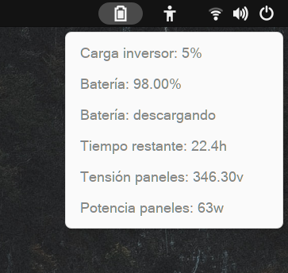
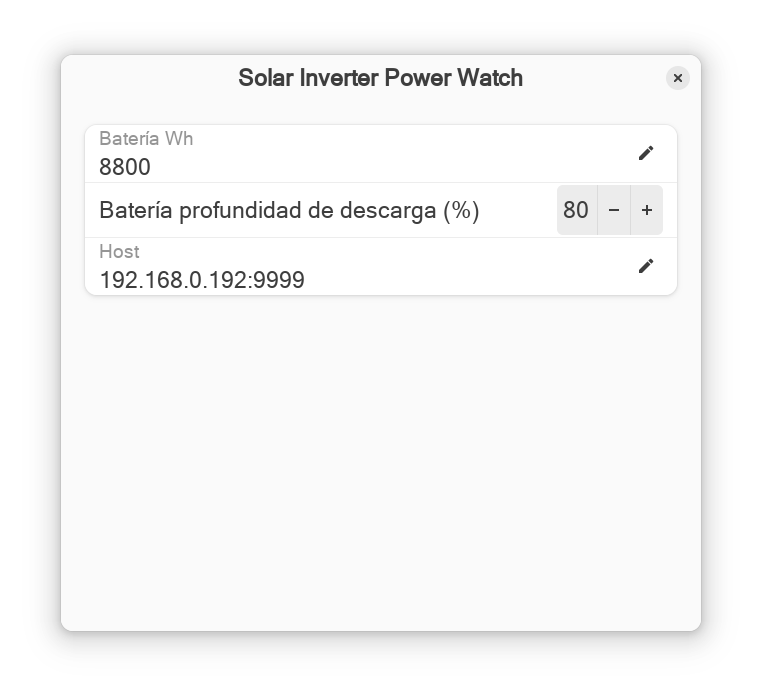

# Gnome extensions
This is a extension for Gnome to take a quick view of the inverter and battery status without opening a browser.
The battery icon shows when the battery is charging or discharging.

## Extension's settings
**Battery Wh**: Set your battery bank capacity here.

**Battery discharge depth**: The max percentage of battery capacity used to estimate the time remaining.

**Host**: Self explanatory. The host address and port.

