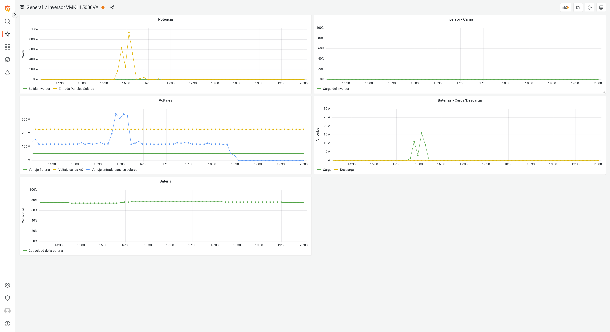

# Bluetooth Inverter Watch
After some reverse engineering I manage to decode and present the stats in order to monitor an *Axpert VM III* inverter using the Bluetooth connection.
Why using Bluetooth instead of the USB serial connection? you may ask. Well, is simple my control panel from the inverter burnout after several months using the serial connection. So after the long RMA process to get back and running the inverter I decided to not take any risks. No cables, no voltage picks, no fuses burnt or anything weird can happen :).

# Get started
## Connect to the inverter
Is important to pair the inverter before executing the binary. Before that, make sure that Bluetooth service is up and running with:
```
sudo /etc/init.d/bluetooth status
```

If is down you can start it with:
```
sudo /etc/init.d/bluetooth start
```

To scan/find the device and pair it you can use the `bluetoothctl` utility. Or use the script `autoconnect.sh` witch you may need to modify with the inverter bluetooth address and password.
**NOTE:** the default password is usually `123456`.

**UPDATE:** since version `0.1.2` the `autoconnect.sh` script is no longer needed 😃.

## Configure the parameters
Make sure to configure the `.env` file and that is accessible to the binary.

### .env
Example `.env` file:
```
# Influx database configuration
INFLUXDB2_HOST=http://localhost:8086
INFLUXDB2_ORG=home
INFLUXDB2_BUCKET=inverter
INFLUXDB2_API_TOKEN=the_api_token_here

# Inverter Bluetooth configuration
POOLING_PERIOD=20
POOLING_NIGHT_PERIOD=300
INVERTER_BT_ADDRESS="48:70:1E:53:38:FC"

# Web server configuration
WEB_SERVER_PORT=9999
```

**NOTE:** The periods are in seconds.

### Standalone web server
A web server will be deployed to access some of the inverter's current data directly from the browser at `http://localhost:9999` or the port you have configured in the `.env` file.


### Influxdb2
And instance of Influxdb must be already configured and up and running before executing the binary. The binary will write to the specified bucket in the given period if the inverter is connected. After that you can use the data as you wish, for example in Grafana.

Like so:

*A docker implementation can be found on the extras folder*.

# Install Service
Execute the script `install.sh` with sudo in order to install the binary as a systemd service.
Is important to note that the `install.sh` script, the binary `bt`, the `.env` file and finally the `bt.service` must be located on the same place/dir otherwise it won't work.
Like so:
```
folder/
    - install.sh
    - bt.service
    - bt
    - .env
```

Check the status:
```
systemctl status bt.service
```

And finally start the service:
```
systemctl start bt.service
```

To check errors:
```
journalctl -xe
```

# Compile and test
```
cargo run
```

# Release build
```
cargo build --release
```

# Disclosure
I'm no expert on Rust neither Bluetooth protocols, in fact this is the first time I do some kind of reverse engineering on a Bluetooth device. What I'm trying to say is don't expect too much from my code or my naive approach.
